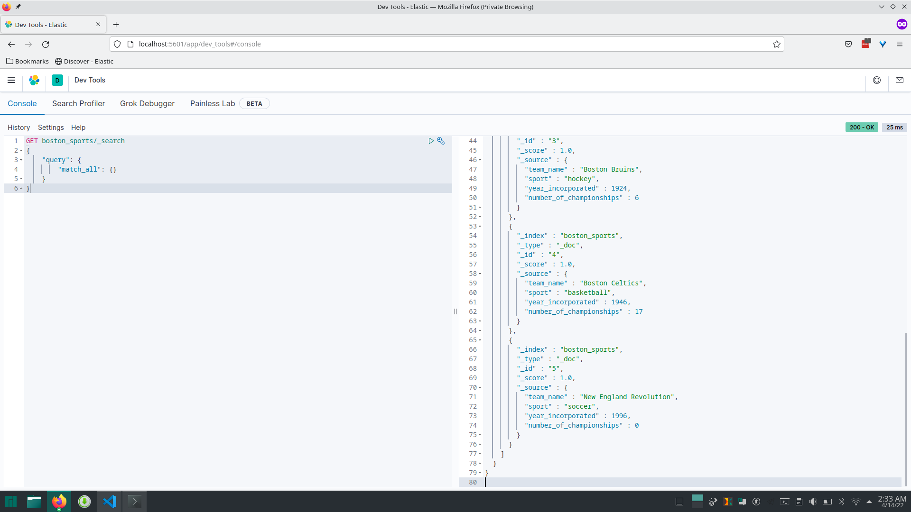

# Procedure to install Elasticsearch and Kibana version 7.9.2 on Linux

1. Ensure Docker and Docker Compose are installed and running.

2. On the command line, run `echo 'vm.max_map_count=262144' >> /etc/sysctl.conf` to [increase the virtual memory available](https://www.elastic.co/guide/en/elasticsearch/reference/current/vm-max-map-count.html).
    1. Run `sysctl -p` to apply the changes.
    2. Verify that the changes were applied by running `sysctl vm.max_map_count`.

3. On the command line, CD to the directory where you want to install Elasticsearch and Kibana.

4. `git clone git@github.com:Stackeduary/EE2022.git` to clone the repository.

5. `cd EE2022`

6. `docker-compose up -d` to start the containers.

7. `docker-compose ps` to check the status of the containers.
    
    The status of both containers should be running. 
    
    Verify that the Elasticsearch instance is running by running `curl -XGET http://localhost:9200`. 
    
    You should see an elasticsearch JSON object with the tagline `"tagline" : "You Know, for Search"
`.

8. Open the browser and navigate to http://localhost:5601 to access the Kibana user interface.

 
 

# Executing scripts to create indices, create mappings and add structured data to indices

Elasticsearch is a free and open-source, distributed, RESTful search and analytics engine. Data are stored in schema-less JSON format.

- An index is analogous to a relational database.

- Within indices are types, which are analogous to relational database tables.

- Types are comprised of documents, which are analogous to rows in a relational database table.

- Indices are created and retrieved using HTTP methods.

 

Let's begin.

### To create an index, the general format is:

`curl -X POST 'localhost:9200/index_name/type_name/document_id' -d '{"field": "value"}'`

 

### Using the [example on elastic.co's documentation](https://www.elastic.co/guide/en/elasticsearch/painless/current/painless-walkthrough.html) as a guide, let's create an index called `boston_sports`.

`curl -X PUT "localhost:9200/boston_sports?pretty"`

 

### Next, let's define a [mapping](https://www.elastic.co/guide/en/elasticsearch/reference/current/mapping.html) for the `boston_sports` index. But before we do that, let's ensure that the index doesn't already exist, since we'll get an error if it does.

`curl -X DELETE "localhost:9200/boston_sports"`

(Getting a 404 HTTP response in this situation is a good thing as it indicates that the attempt to delete an index that doesn't already exist was not successful, which is what we expect.)

 

`curl -X PUT "localhost:9200/boston_sports?pretty" -H 'Content-Type: application/json' -d'
{
  "mappings": {
    "properties": {
      "team_name": { "type": "text" },  
      "sport": { "type": "text" }, 
      "year_incorporated": { "type": "integer" },
      "number_of_championships": { "type": "integer" }
    }
  }
}'`

 

### Now let's insert some structured data into the index.

`curl -X PUT "localhost:9200/boston_sports/_bulk?refresh&pretty" -H 'Content-Type: application/json' -d'
{"index":{"_id":1}}
{"team_name": "New England Patriots", "sport": "football", "year_incorporated": 1959, "number_of_championships": 6}
{"index":{"_id":2}}
{"team_name": "Boston Red Sox", "sport": "baseball", "year_incorporated": 1901, "number_of_championships": 9}
{"index":{"_id":3}}
{"team_name": "Boston Bruins", "sport": "hockey", "year_incorporated": 1924, "number_of_championships": 6}
{"index":{"_id":4}}
{"team_name": "Boston Celtics", "sport": "basketball", "year_incorporated": 1946, "number_of_championships": 17}
{"index":{"_id":5}}
{"team_name": "New England Revolution", "sport": "soccer", "year_incorporated": 1996, "number_of_championships": 0}
'
`

 

### Finally, let's do the equivalent of `SELECT * FROM table_name` in SQL to ensure that there's actual data in the `boston_sports` index.

`curl -X GET "localhost:9200/boston_sports/_search?pretty" -H 'Content-Type: application/json' -d'
{
  "query": {
    "match_all": {}
  }
}
'`

# Screenshots of Kibana displaying the data from the `boston_sports` index:

### Thanks for reading and happy ELKing!